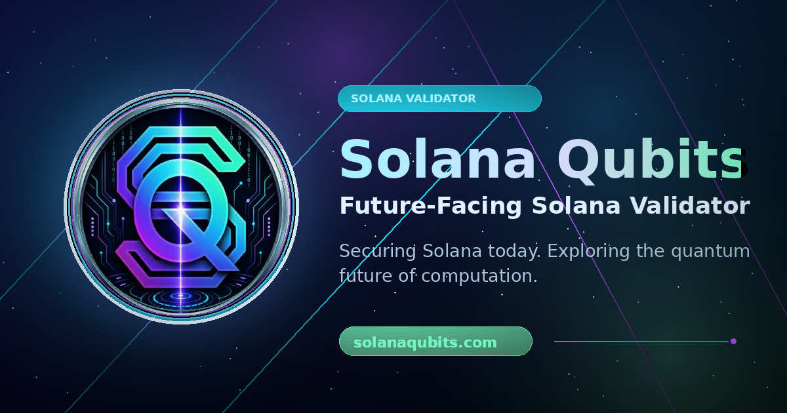

  

# Solana Qubits About

Solana Qubits is an independent Solana validator initiative focused on reliable infrastructure, transparent ecosystem participation, public research, and educational resources.

## Contents

- Validator and contributions profile: [link](./docs/solana-qubits-validator-and-contributions.md)
- Brand accounts and contact links: [link](./docs/brand-accounts.md)

## Learning Resources

- [Quantum Technologies Explained Like I’m 5](./docs/learn/quantum-technologies-explained-like-im-5.md)
  - Website version: https://solanaqubits.com/resources/quantum-technologies-explained
  - Learning repository: https://github.com/solanaqubits/solanaqubits-learn
  - Learn repo article: https://github.com/solanaqubits/solanaqubits-learn/blob/main/docs/learn/quantum-technologies-explained-like-im-5.md
  - Announcement on X: https://x.com/solanaqubits/status/2067666966576353447

## Research Resources

- [Solana Validator Client Landscape: Agave, Frankendancer, Firedancer, and Emerging Alternatives](https://solanaqubits.com/research/solana-validator-client-landscape)
  - Research repository: https://github.com/solanaqubits/solanaqubits-research
  - Article Markdown: https://github.com/solanaqubits/solanaqubits-research/blob/main/articles/solana-validator-client-landscape.md
  - Source index: https://github.com/solanaqubits/solanaqubits-research/blob/main/sources/solana-validator-client-landscape-links.md

## Main Links

- Website: https://solanaqubits.com
- Resource hub: https://solanaqubits.com/resources
- AI Tools and LLM Resources: https://solanaqubits.com/resources/ai-tools
- Education hub: https://solanaqubits.com/education
- Research hub: https://solanaqubits.com/research
- Validator client landscape: https://solanaqubits.com/research/solana-validator-client-landscape
- Tools section: https://solanaqubits.com/#tools
- X / Twitter: https://x.com/solanaqubits
- GitHub profile: https://github.com/solanaqubits
- Contact: validator@solanaqubits.com

## Public Repositories

- About: https://github.com/solanaqubits/solanaqubits-about
- Learn: https://github.com/solanaqubits/solanaqubits-learn
- Research: https://github.com/solanaqubits/solanaqubits-research
- Stake pool data: https://github.com/solanaqubits/solana-stake-pools
- Validator Tools: https://github.com/solanaqubits/solanaqubits-validator-tools
- AI Tools (public repository bootstrap; no tools or code are claimed as published yet): https://github.com/solanaqubits/solanaqubits-ai-tools

## Disclaimer

This repository is informational only. Validator metrics, program requirements, and ecosystem listings can change. Always verify current information through official sources.
