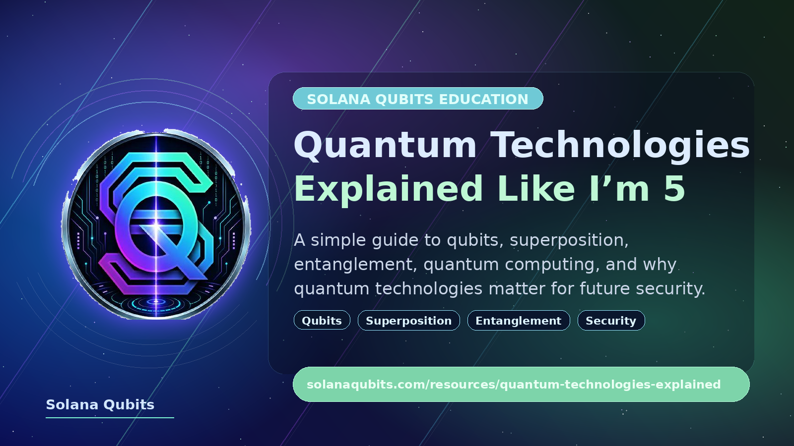

<p align="center">
  
</p>

# Quantum Technologies Explained Like I’m 5

## An ELI5 Guide by Solana Qubits

Quantum technologies sound complicated: qubits, superposition, entanglement, quantum computers, quantum cryptography. But the basic idea can be explained in simple terms.

Regular computers work with the world we are used to: electricity is either on or off, `1` or `0`. Quantum technologies work with the very small world — the world of atoms, electrons, photons, and other particles. In that world, nature behaves differently from a cup on a table or a ball in your hand.

Quantum technologies are an attempt to use these unusual properties of the microscopic world for computing, communication, measurement, and security.

---

## 1. A regular bit: a tiny switch

In a regular computer, information is stored in bits.

A bit is like a light switch:

```text
0 = off
1 = on
```

Every photo, video, website, game, application, and blockchain ultimately consists of huge numbers of these `0`s and `1`s.

This is an extremely powerful idea. The modern internet, smartphones, servers, artificial intelligence, and blockchains all work this way.

---

## 2. A qubit: not just a switch

A qubit is the quantum version of a bit.

It is often explained like this:

```text
regular bit = 0 or 1
qubit = kind of 0 and 1 at the same time
```

That is a useful first analogy, but it is not fully accurate.

A better way to imagine a qubit is as a very small “probability arrow.” Before we measure a qubit, it is not described by a simple value like `0` or `1`, but by a quantum state that contains probabilities. When we measure the qubit, we get a specific result: `0` or `1`.

So a qubit is not a magical bit that stores everything at once. It is an object that follows quantum rules and can use probabilities, waves, and interference for computation.

---

## 3. Superposition: a coin that has not landed yet

The most common analogy for superposition is a coin.

A regular coin, after it lands, shows:

```text
heads or tails
```

But while it is spinning in the air, we do not yet know the result.

A qubit in superposition is a little like that spinning coin. Before measurement, it is not simply in state `0` or state `1`. It is in a quantum state that can produce different outcomes with different probabilities.

But there is an important difference: superposition is not just “we do not know the result.” In the quantum world, the state really behaves like a wave of probabilities. That is what makes quantum computing special.

---

## 4. Measurement: when the quantum world becomes classical

When we measure a qubit, it gives a regular result:

```text
0 or 1
```

After measurement, we no longer see the whole “quantum picture.” We get one specific answer.

This is similar to a spinning coin finally landing on the table. Before it lands, there is uncertainty. After it lands, there is a specific result.

In quantum computing, much of the “magic” is about preparing the qubits correctly before measurement, so that the desired answer becomes more likely.

---

## 5. Interference: waves can amplify or cancel each other

To understand quantum computers, it helps to understand the idea of interference.

Imagine waves on water. When two waves meet, they can:

- amplify each other;
- weaken each other;
- almost completely cancel each other out.

Quantum states also behave like waves of probability. A quantum algorithm tries to make wrong answers cancel each other out, while making correct answers stronger.

This is one of the core ideas of quantum computing:

```text
not simply trying every possible answer,
but shaping probability waves
so that the correct answer becomes easier to see
```

---

## 6. Entanglement: when qubits are connected in an unusual way

Quantum entanglement is another famous idea.

A simple analogy: imagine two magical coins. If one shows heads, the other immediately shows a related result. But this is not just a normal pre-written agreement. In quantum physics, the connection between particles is deeper and stranger.

Entangled qubits cannot be fully described separately. They have to be described as one shared system.

Important: entanglement does not allow messages to be sent faster than light. That is a common myth. But it does allow special quantum correlations that are useful for computing, quantum communication, and experiments.

---

## 7. A quantum computer: not “faster at everything”

A quantum computer is a device that uses qubits instead of regular bits.

But it is important to understand:

```text
a quantum computer is not simply a faster regular computer
```

It will not replace laptops, smartphones, gaming PCs, or ordinary servers. For most everyday tasks, regular computers are still better, cheaper, and more reliable.

Quantum computers are interesting because they may provide huge advantages for some special types of problems.

For example:

- simulating molecules and materials;
- chemistry and pharmaceuticals;
- certain optimization problems;
- quantum physics;
- some mathematical problems;
- potential impact on cryptography.

---

## 8. Why quantum computers are so difficult

Qubits are very fragile.

A regular bit in a computer is relatively stable. It stores `0` or `1`, and engineers know how to do this very reliably.

A qubit can easily lose its quantum behavior because of interaction with the surrounding world:

- heat;
- noise;
- vibrations;
- electromagnetic interference;
- unwanted measurement;
- control errors.

When a qubit loses its quantum state, this is called decoherence.

That is why quantum computers often require:

- extremely low temperatures;
- complex equipment;
- protection from noise;
- error correction;
- precise control.

The main challenge today is not just creating qubits. The challenge is creating many stable and useful qubits that can work together for long enough.

---

## 9. Quantum error correction

Regular computers can also have errors, but those errors are relatively easy to detect and correct.

In quantum computers, everything is harder because you cannot simply copy an unknown qubit and check it like a regular bit. Quantum information follows different rules.

Researchers therefore build special methods for quantum error correction. The idea is to use many physical qubits to create one more reliable logical qubit.

In simple terms:

```text
many fragile qubits together can create
one more useful and stable qubit
```

This is one of the key challenges on the path toward large practical quantum computers.

---

## 10. Quantum technologies are not only computers

When people hear “quantum technologies,” they often think only about quantum computers. But the field is much broader.

Quantum technologies include:

### Quantum computing

Using qubits to solve special computational problems.

### Quantum communication

Using quantum properties to transmit information and create more secure communication channels.

### Quantum cryptography

Security methods based on quantum physics.

### Post-quantum cryptography

New cryptographic algorithms for regular computers that are designed to remain secure against future quantum attacks.

This is important: post-quantum cryptography does not require a quantum computer. It runs on regular computers, but it is designed for a world where quantum computers may become more powerful.

### Quantum sensors

Very precise sensors that use quantum effects to measure time, gravity, magnetic fields, and other quantities.

### Quantum random number generators

Devices that use quantum uncertainty to create true randomness.

---

## 11. Why this matters for security

One reason quantum technologies are discussed so much is cryptography.

Many modern security systems rely on mathematical problems that are extremely hard for regular computers to solve. For example, some types of cryptography rely on the fact that factoring very large numbers would take too much time.

In theory, a large and stable enough quantum computer could attack some older cryptographic systems much more efficiently than a regular computer.

This does not mean the entire internet will “break tomorrow.” But it does mean the industry is already preparing for the future.

That is why the following areas matter:

- quantum cryptography research;
- post-quantum cryptography;
- updated security standards;
- careful planning for long-term systems.

---

## 12. Quantum technologies and blockchains

Solana, like other modern blockchains, currently runs on classical infrastructure:

- regular servers;
- regular networks;
- regular processors;
- classical cryptography;
- validators;
- RPC infrastructure;
- data centers and bare metal servers.

Quantum computers do not currently make blockchains faster and are not part of normal validator operations.

But quantum technologies are important as a long-term topic for several reasons:

1. **Cryptography**  
   Blockchains depend on cryptographic signatures and keys. In the future, the industry will need to track the development of post-quantum cryptography.

2. **Infrastructure thinking**  
   Validators are part of the network’s critical infrastructure. Long-term infrastructure work requires awareness of future technology risks and trends.

3. **Education**  
   Quantum technologies are surrounded by myths. Simple explanations help the community understand the real picture.

4. **Future computing**  
   Quantum computers may be useful in science, simulation, optimization, and security. This may affect many industries, including Web3, but not as instant magic.

Solana Qubits does not claim that Solana already uses quantum computing. The idea behind the brand is to look toward the future of computation, infrastructure, and security while contributing useful resources to the Solana ecosystem today.

---

## 13. What quantum computers do NOT do

It is important to clear up a few myths.

### Myth 1: “A quantum computer is faster than any regular computer”

No. It may be faster only for certain special problems.

### Myth 2: “A qubit stores infinite information”

No. When measured, a qubit gives a regular result: `0` or `1`. The power of qubits is not that you can simply read infinite data from them, but in how quantum states interact before measurement.

### Myth 3: “Entanglement allows messages to travel faster than light”

No. Entanglement creates unusual correlations, but it does not create a normal communication channel faster than the speed of light.

### Myth 4: “Quantum computers will soon break everything”

It is not that simple. Serious attacks would require large, stable, error-corrected quantum computers. That is a difficult engineering challenge. But preparing for the future still matters.

### Myth 5: “Quantum technologies are only hype”

No. This field has real science, real experiments, and real products. But there is also a lot of hype around it, so it is important to separate facts from marketing.

---

## 14. One simple analogy

If we explain it very briefly:

A regular computer is like a huge library of switches. Each switch is either on or off.

A quantum computer is like a very delicate musical instrument made of probability waves. It does not simply try options one by one. It tries to make wrong answers become quieter and correct answers become louder.

But this instrument is extremely fragile. It is hard to build, hard to tune, and hard to protect from noise.

---

## 15. Why learn about quantum technologies now

Even if practical quantum computers are not yet mainstream, learning about this field is useful today.

Quantum technologies sit at the intersection of:

- physics;
- mathematics;
- computer science;
- cryptography;
- engineering;
- security;
- future computing infrastructure.

Understanding the basic ideas helps us better understand the future of technology.

---

## 16. Short glossary

### Bit

The smallest unit of information in a regular computer. It can be `0` or `1`.

### Qubit

A quantum unit of information. When measured, it gives `0` or `1`, but before measurement it is described by a quantum state.

### Superposition

A quantum state where the measurement result is not yet defined as a regular `0` or `1`.

### Measurement

The process by which a quantum state produces a specific classical result.

### Entanglement

A quantum connection between particles or qubits, where they cannot be fully described separately.

### Interference

The amplification or cancellation of quantum probabilities, similar to how waves interact.

### Decoherence

The loss of a quantum state due to interaction with the environment.

### Quantum error correction

Methods for protecting quantum information from noise and errors.

### Post-quantum cryptography

Cryptography for regular computers that is designed to remain secure in a future world with powerful quantum computers.

---

## 17. The main idea

Quantum technologies are not magic and not simply “faster computers.”

They are a new way to use the laws of nature at a very small scale. They may change computing, communication, security, and scientific research, but the path toward that future is complex and gradual.

For Solana Qubits, quantum technologies are part of a long-term view of infrastructure, security, and computation.

Today, we build and support Solana validator infrastructure. At the same time, we want to create simple educational materials that help the community better understand future technologies.

---

## Discussion / Announcement

- Website version: https://solanaqubits.com/resources/quantum-technologies-explained
- Announcement post: https://x.com/solanaqubits/status/2067666966576353447

---

## Disclaimer

This material is educational and simplified. It is not a scientific paper, investment advice, or a technical specification. Quantum technologies are evolving quickly, so details, estimates, and practical capabilities may change over time.
