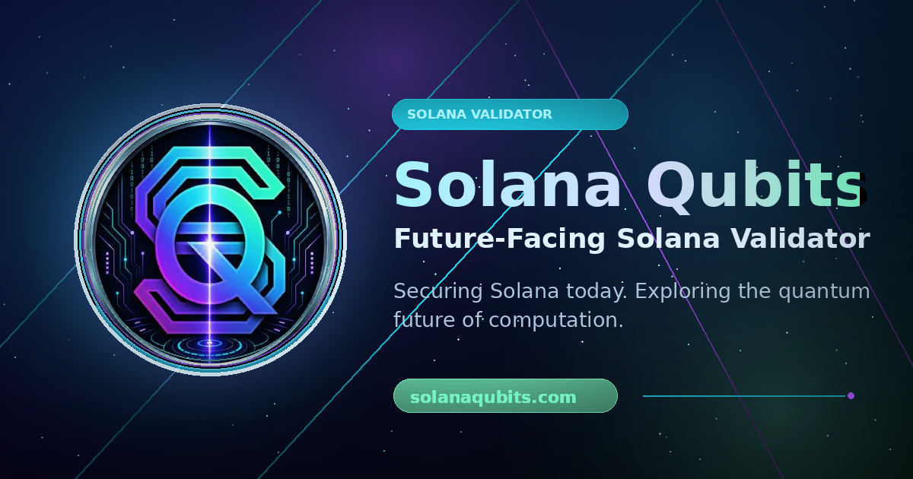

  

# Solana Qubits Validator and Contributions

## Overview

Solana Qubits is an independent Solana validator initiative focused on reliable validator infrastructure, transparent ecosystem participation, public research, open-source materials, and educational resources.

The goal of this repository is to provide a public, source-linked contribution snapshot that can be used to understand the Solana Qubits validator profile, public identity, ecosystem participation, and public-good resources for validators and delegators.

Focus areas include:

- Reliable validator infrastructure
- Transparent ecosystem participation
- Public research
- Open-source data
- Educational resources
- Useful public-good materials for validators and delegators

## Validator Profile

Primary public links:

- Website: https://solanaqubits.com
- Contact email: validator@solanaqubits.com
- X / Twitter: https://x.com/solanaqubits
- GitHub organization: https://github.com/solanaqubits

Validator and explorer links:

- Mainnet Validators.app: https://www.validators.app/validators/EAW9vxqogvdPNapq7QTDpiVTHK6o7begUhPVnf854VTc?locale=en&network=mainnet
- Testnet Validators.app: https://www.validators.app/validators/FAfKvBBvmSVFhsWM7D3geMeT5ckEdU3neBUPwW8Hh7Ee?locale=en&network=testnet
- StakeWiz: https://stakewiz.com/validator/DyDjFYB6i51FMHQvB4eKSwGHmgMxVf1i3FWwANAngqyY
- JPool direct staking: https://app.jpool.one/direct-staking?vote=DyDjFYB6i51FMHQvB4eKSwGHmgMxVf1i3FWwANAngqyY
- Sandwiched: https://sandwiched.me/validators/DyDjFYB6i51FMHQvB4eKSwGHmgMxVf1i3FWwANAngqyY?tab=sandwich
- Malbec Labs: https://data.malbeclabs.com/solana/validators/DyDjFYB6i51FMHQvB4eKSwGHmgMxVf1i3FWwANAngqyY

Current validator facts:

- Validator commission: 5%
- Jito MEV commission: 0%
- Estimated APY: approximately 6%

Estimated APY is shown for informational purposes only and can change over time.

## Ecosystem Participation

The Solana Qubits website currently presents the following ecosystem participation and visibility items. These items are informational and should be verified against current official or source records before use in any application or decision process.

- Solana Foundation Delegation Program: SFDP participant visibility
- Jito: Top list BAM validator visibility
- JPool: JPDP validator visibility
- DoubleZero: DZDP validator visibility
- Edgevana: Edgevana top list validator visibility

These references do not imply partnership, sponsorship, endorsement, approval, guaranteed delegation, or guaranteed future status from any ecosystem program or organization.

## Public Contributions

Current public contributions and resources include:

1. Public validator website
   - https://solanaqubits.com

2. Public resource hub
   - https://solanaqubits.com/resources

3. Solana stake pool delegation landscape research
   - https://solanaqubits.com/resources/solana-stake-pool-delegation-landscape
   - https://x.com/solanaqubits/status/2067259338364711235

4. Open-source research materials
   - https://github.com/solanaqubits/solanaqubits-research

5. Structured stake pool dataset
   - https://github.com/solanaqubits/solana-stake-pools

6. Public communication channels
   - X / Twitter: https://x.com/solanaqubits
   - Telegram channel: https://t.me/solanaqubits
   - Telegram chat: https://t.me/solanaqubitschat
   - Telegram contact: @solanaqubit
   - GitHub: https://github.com/solanaqubits

## Research and Data

The Solana stake pool delegation landscape research is an informational snapshot intended to help validators and delegators understand a range of Solana stake pools, delegation programs, public requirements, and source links.

The current research and dataset include references to:

- Phase
- JPool
- BlazeStake
- DynoSol
- DoubleZero
- Definity
- JagPool
- Edgevana
- SolStrategies
- Vault
- Marinade
- Jito
- Shinobi xSHIN

Difficulty labels and best-fit notes are subjective and should be treated as practical guidance, not definitive rankings. Program requirements, validator eligibility, delegation criteria, and source links can change. Always verify current information with official sources.

Related materials:

- Website article: https://solanaqubits.com/resources/solana-stake-pool-delegation-landscape
- Research repository: https://github.com/solanaqubits/solanaqubits-research
- Stake pool data repository: https://github.com/solanaqubits/solana-stake-pools

## Delegation Program Proof Links

The following public links may be useful as a concise reference set for delegation program applications, validator review, or public identity checks:

- Website: https://solanaqubits.com
- Resources page: https://solanaqubits.com/resources
- Stake pool research article: https://solanaqubits.com/resources/solana-stake-pool-delegation-landscape
- X research thread: https://x.com/solanaqubits/status/2067259338364711235
- Phase quote repost: https://x.com/solanaqubits/status/2067621325376496053
- GitHub about repository: https://github.com/solanaqubits/solanaqubits-about
- GitHub research repository: https://github.com/solanaqubits/solanaqubits-research
- GitHub stake pools data repository: https://github.com/solanaqubits/solana-stake-pools
- Mainnet Validators.app: https://www.validators.app/validators/EAW9vxqogvdPNapq7QTDpiVTHK6o7begUhPVnf854VTc?locale=en&network=mainnet
- StakeWiz: https://stakewiz.com/validator/DyDjFYB6i51FMHQvB4eKSwGHmgMxVf1i3FWwANAngqyY
- Malbec Labs: https://data.malbeclabs.com/solana/validators/DyDjFYB6i51FMHQvB4eKSwGHmgMxVf1i3FWwANAngqyY
- Contact email: validator@solanaqubits.com
- Telegram contact: @solanaqubit

## Roadmap

Future contribution directions may include:

- More validator and staking educational materials
- Beginner-friendly Solana infrastructure explainers
- Basic quantum technology explainers
- Structured public datasets
- Corrections and contributions from the community
- Website pages based on public GitHub materials

This roadmap is informational and may change as priorities, available data, and ecosystem needs evolve.

## Disclaimer

This repository is informational only and is not financial advice. Validator metrics, estimated APY, validator performance, delegation program rules, and ecosystem listings can change over time. Always verify current validator data and program requirements through official sources.
